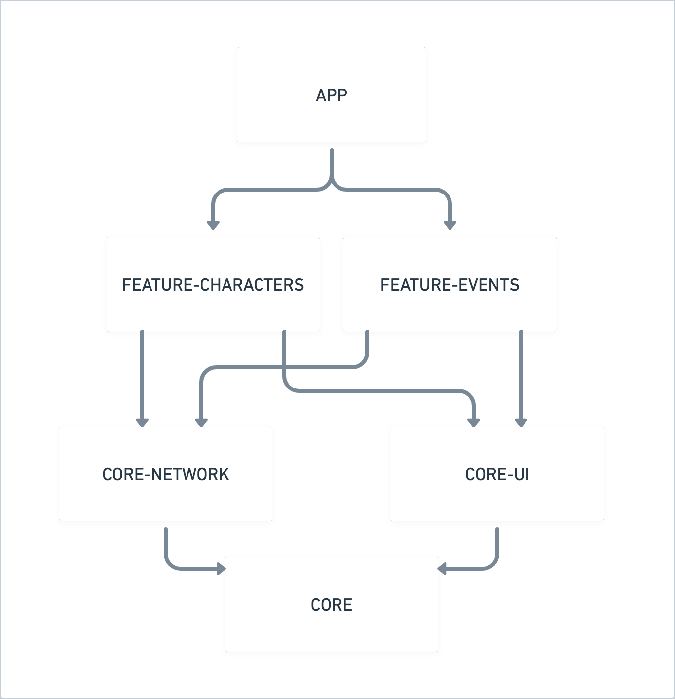
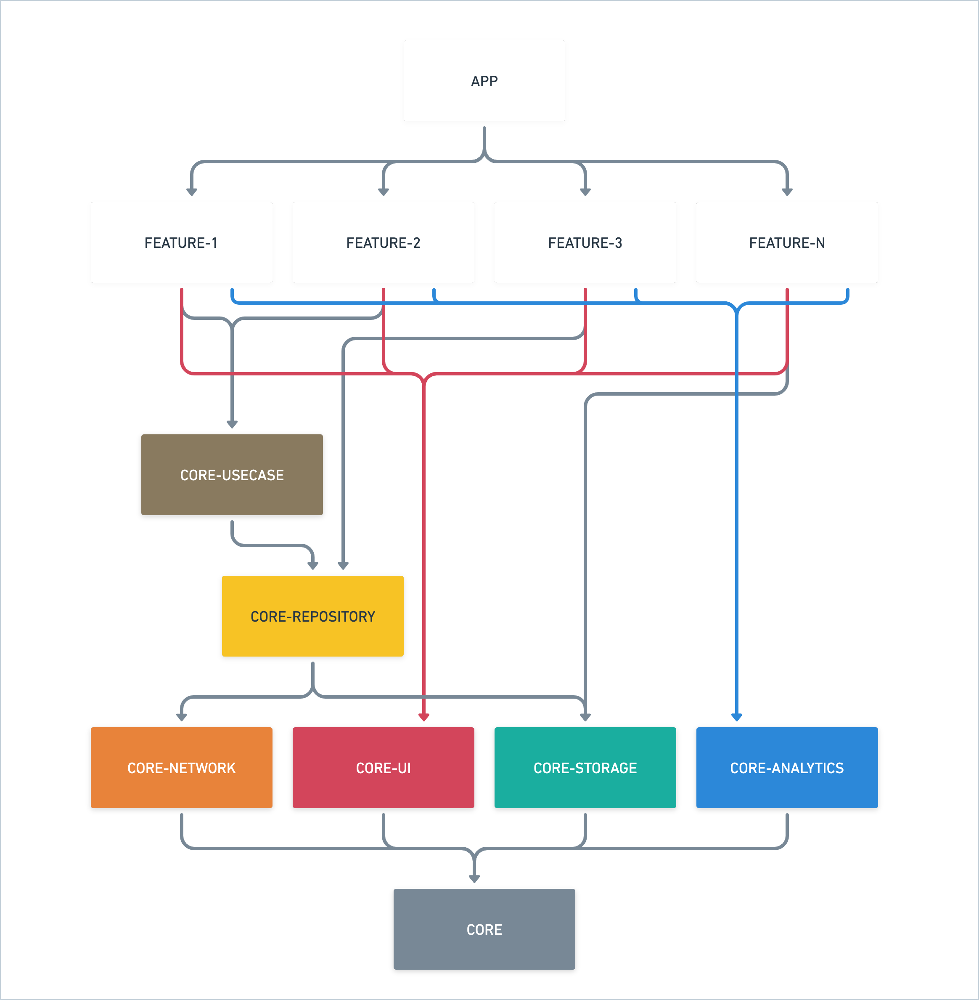
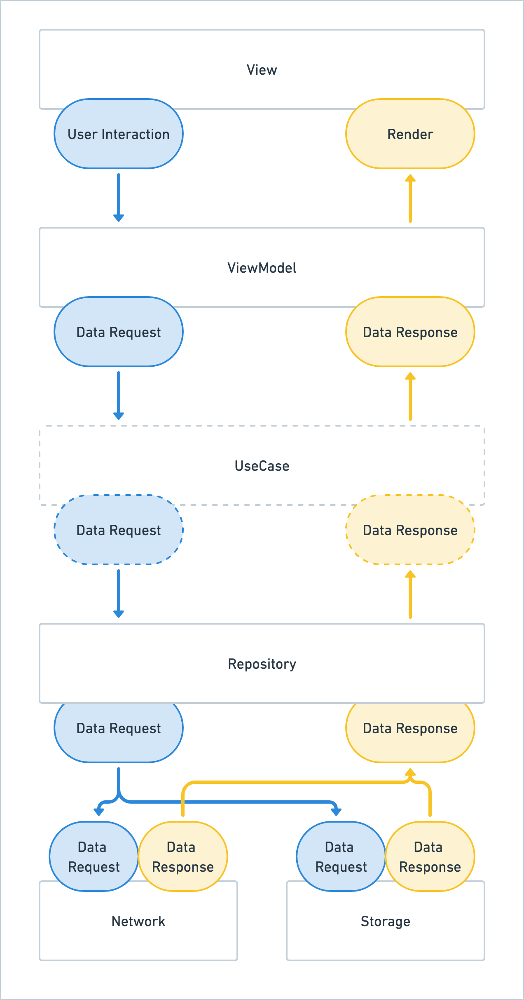

# Template / Sample for an Android Compose Application

## Summary

This app is a sample for our Android applications using compose - and serves as a default implementation for the Android team at Fueled.
It should help us to have a unified standard solution which can be used to bootstrap new projects and to have a consolidated solid approach to our general app structure.

## Build Script
As this application is modularised by feature, there is a risk of build script boilerplate across 
each of the modules. Therefore, 
[`Convention Plugins`](https://docs.gradle.org/current/samples/sample_convention_plugins.html) 
have been implemented on the project to alleviate this boilerplate. (_Refer to the 
[`documentation`](build/ConventionPlugins.md) for available plugins within the project._)

If you projects build script requires a `classpath` (_i.e. a dependency that is required by the 
buildscript_), then this can be added to the root [`build.gradle.kts`](../build.gradle.kts) file
as a plugin instead. See below example:
```kotlin
buildscript {
    repositories {
        mavenCentral()
    }
}

plugins {
    // ...
    id("com.google.gms:google-services") version "4.3.14" apply false
}

```
However if a Convention Plugin requires this dependency, it should instead be added as a dependency
to the [`build-logic`](../build-logic) module. Please refer to 
`Creating a new Plugin` in the [Convention Plugins documentation](build/ConventionPlugins.md)

## Module Structure

This app is modularized by features, and as some code can be used in all the features, there are some low-level tech modules as well.
This means the general rule for creating new code:
Anything that is feature-specific should be placed in the respective feature module, and common code that is used in more than 1 feature should be placed into a common module.



### CORE
The lowest level module having code that is used by multiple other modules. This houses base classes and common interfaces.
- `NavigationDestination` interface is implemented by all composables that can serve as a navigation destination.
- `BaseViewModel` - Extracts the common functionality of the ViewModels: ViewState and ViewAction handling.
- `BaseState` - All ViewStates used by the ViewModel have to implement this class, as all states have common behaviours: It can load and fail with an error.
- `ViewEvent` - All features should have some form of View Events, such as navigation. This class represents those events
- `SideEffect` - An interface allowing features to implement feature specific side effects.
- `BaseScreen` - An interface which should be implemented on any target Screens defined within a feature 
- `ErrorState` - Included in the BaseState this class provides an abstraction for different error states used by the app (as how the error should be handled on the view)
- `DispatcherProvider` - It can be injected into classes where we need dispatchers for coroutines.
- `StringProvider` - This class can be injected into classes where we need strings from the Android resources and no context is available.

### CORE-UI
This module contains all common UI related code and resources. Some examples of what it can be:
- Common compose components that are used in multiple or in all feature modules.
- Compose, layout extension functions
- Flow extension functions that are connected with view logic
- Resources: Colors, dimensions, shapes, themes, drawables etc.

### CORE-NETWORK
This module holds common network-related logic and most importantly it provides the Retrofit instance via DI to all retrofit services
placed in the different feature modules.

### FEATURE/[feature_name]
This is the main home for a feature (such as a given screen or multiple screens belonging to a logical module).
Use `com.fueled.chatty.feature.{feature_name}` replace dashes and underscores in package names with dots, you can still use dashes in module name (gradle).  
In this template app we have 3 feature modules:
- auth: A simple module for demonstrating an authentication layer. Provides just a simple login screen. (_no username or password is required to login, these can be left blank_)
- characters: Currently this module contains the list of characters screen and the detail screen.
- events: this is a placeholder for later.

### APP
- Home of the main activity, application and the navigation-related code.

#### Possibility for scaling
As it can happen that some repositories, entities and/or use-cases are not just one feature-specific, and can be used by multiple features, placing them in 1 feature would introduce problems. To avoid code duplication, it is recommended to identify such common entities (in this case think of repos and similar) and add them as new modules.
A possible scenario can look like this:



## Architecture, Data Flow Design and other Technologies used

### ApiModels and Entities
JSONs arriving from the API are modelled via Api Models (ex [`CharacterApiModel`](../feature/characters/src/main/kotlin/com/fueled/android/feature/characters/data/model/CharacterApiModel.kt)), which then are turned into entities used in the app's internals. This separation allows us flexibility from the API: we can introduce different types, handle optionals, and identify API related issues. If the API changes, we are not required to change the presentation layer and/or classes which invoke the repository calls, it is enough to adjust the ApiModels and their mapping accordingly.
This also allows for introduction of alternative data sources down the line. Say an `Offline First` strategy was to be introduced, with the presentation layer consuming domain layer models, no logic would need changed beyond the repository; rather just the implementation of the DB models and their mapping to domain models.

### Feature folder structure
We should aim toward a lean, simple and unified folder structure in feature modules.
- data: ApiModels, Data sources such as Services (Retrofit Services) + Api Classes, Database classes, Repositories
- domain: Internal Entity Models, Possibly UseCases
- presentation: ViewModels and Views, possibly adapters
- navigation: NavigationDestinations (in our case)
- di: Hilt related modules, providers etc

In the feature modules where we might have separate sub-feature (such as in this case: list and details of the characters) we might need sub-feature specific folders:
- data, domain, presentation, navigation, di: all the commonalities used in both subfeatures
- feature specific folders: code which is only needed in a specific sub-feature.

- data
- domain
- presentation
- navigation
- di
- feature
  - {feature_name}
    - data
    - domain
    - presentation
    - navigation
  - {feature_name}
    - data
    - domain
    - presentation
    - navigation

### Data flow
The image below shows the default data (request/response) data flow.



### Dependency Injection
We use Hilt as Dependency Injection, and as a default rule: nothing should be responsible for creating their own dependencies, rather inject them possibly through their constructors.

## Features
Feature modules can be divided up at the discretion of the authors. So whether you want a more modular setup or a 1 bigger one - it's up to the lead and the team working on the project.

## Gradle Dependency Management
We use the buildSrc module to declare dependencies that can be then used in other modules. Different 3rd parties and their versions are declared in the Deps.kt and all of them are organised into objects with local versioning. This places the version numbers where they are used, instead of a global Version object, making the versioning more visible and readable.

## Detekt
The project utilizes Detekt as stated in our Android Project Guidelines in Notion.
Detekt can be simply applied using the 
[`DetektConventionPlugin`](../build-logic/src/main/kotlin/DetektConventionPlugin.kt). 
Simply add the following plugin to your feature modules `build.gradle.kts`

```kotlin
plugins {
  // ...
  id("com.fueled.chatty.detekt")
}
```

## Testing

To enable unit test coverage on your `feature-module` simply apply the 
[`TestCoverageConventionPlugin`](../build-logic/src/main/kotlin/TestCoverageConventionPlugin.kt):

```kotlin
plugins {
  // ...
  id("com.fueled.chatty.test.coverage")
}
```

Use JUnit5 as the test runner and mockK for stubbing, spying or mocking as follows:

```kotlin
@ExtendWith(MockKExtension::class)
class SutTest {
  // To use TestCoroutineScheduler from kotlinx-coroutines-test to control the scheduling of the
  // test scope
  private val testDispatcherProvider = TestDispatcherProvider()

  @RelaxedMockK
  private lateinit var mock: AnyDependency

  private lateinit var sut: Sut

  @BeforeEach
  fun setUp() {
    sut = Sut(anyDependency = mock, dispatcherProvider = testDispatcherProvider)
  }
  
  @Test
  fun `any test`() = runTest { // use runTest to run the test in a new coroutine
      // ...
  }
}
```

Write a test for every branch of execution following the Given-When-Name naming convention to 
describe the test and three sections within the body of the test to clearly separate the 
preconditions and initial state from the action and the result.

Use kotest assertion framework to verify the result

```kotlin
@Test
fun `Given preconditions and initial state When the test action Then the outcome resulting from action`() {
  every { mock.dependency() } returns AnyResult()
  
  val result = sut.action()

  result.shouldBeEmpty()
}  
```

In order to execute the same tests that the CI would run you need to install fastlane. To make it 
easier use bundler and the provided `Gemfile` to install and execute fastlane

Execute this line to install fastlane
```
$ bundle install
```

Execute this line to check your code locally
```
$ bundle exec fastlane pr_check
```

`Gemfile.lock` was added to `.gitignore` file so it will install the latest version every time

## How to make this into a new project
To be added
* 
* [How to configure fastlane for release](https://www.notion.so/fueled/Build-Automation-Setup-b4f953d3f74c422ea7329976ae1ece1c) 

## Good to know bits
- when creating a new feature module, it will most likely insert some lines into the project Gradle's plugins block. As these newly inserted lines are already there
  please remove the new lines.
- Using strings and R resources can be tricky a bit with wrong R imports, so be aware to use the `core_ui.R` file
